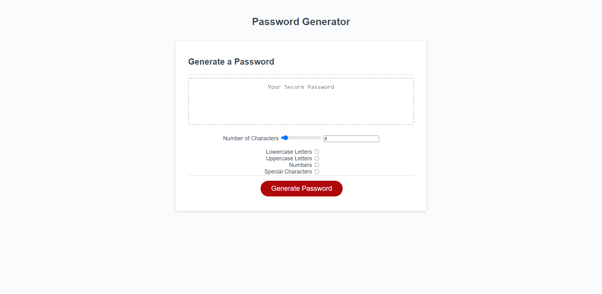

# Password Generator Tool

This is a random password generator tool!

## Purpose of this application

This tool can generate a random password of between 8 and 128 characters long. The user can choose to generate a password contains selected criteria from the following list:

lowercase letters
uppercase letters
numbers
special characters

## Accessibility

This page is fully accessible.

## Screenshot

Here is a screenshot of my password generator page!:

## Link to GitHub Repository

Here is a link to the GitHub repository:
https://github.com/geocode-matt/password-generator

## Link to deployed application

Here is a link to the live web page!:
https://geocode-matt.github.io/password-generator/